<style>
    @import "base";
    @import url("https://fonts.googleapis.com/css2?family=Geist&display=swap");
    :root {
        font-size: 20px;
        font-family: "Geist", sans-serif;
        --color-fg-default: white;
        --color-canvas-default: white;
        padding: 64px;
    }
    footer, header { 
        padding: 32px 32px;
    }
    h1 > strong {
        color: #f1f1f1;
    }
</style>


# **Hands-on Introduction to Multi-agent Path Planning**

In this tutorial, you'll learn to develop a multi-agent path planning algorithm that can navigate through a shared environment in League of Robot Runners.

---

# Open these slides yourself

Find these slides at:
https://pathfinding.ai/opss25-tutorial/

---

# Arc 0: Setup

Before we get going we'll need to:

- Go through a bit of background
- 📦 Use our script to set up your development environment
- 📝 Clone our starting repository
- 👀 Get familiar with the software we'll be using

---

# What we're working towards

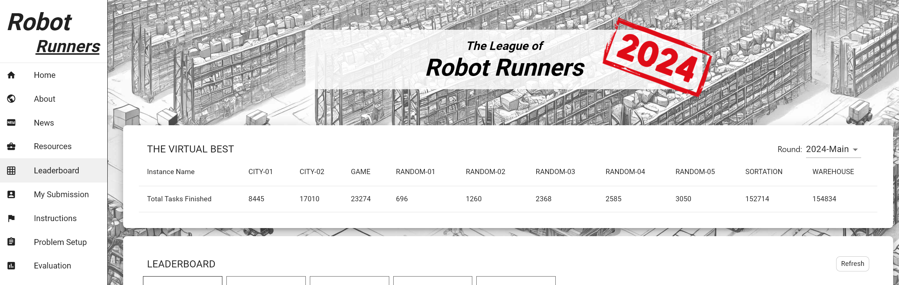

https://www.leagueofrobotrunners.org/

---


We're going to build a system that can plan like this ->

---

# There'll be a competition!

Lets see if that gets you motivated. Details for how to join at the end of the session.

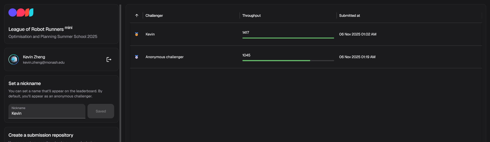

---

# Set up your environment

Open up a terminal and run the following command:

### MacOS

```bash
curl -fsSL https://pathfinding.ai/opss25-setup/install | bash
```

### Linux

```bash
wget -qO- https://pathfinding.ai/opss25-setup/install | bash
```

### Windows

```ps
powershell -c "irm https://pathfinding.ai/opss25-setup/install.ps1 | iex"
```

---

# Setting up the tutorial files

Navigate to a chosen directory in Terminal. Run the following command (using your preferred of https or SSH):

```bash
git clone -b a1 https://github.com/ShortestPathLab/opss25-startkit.git
git clone -b a1 git@github.com:ShortestPathLab/opss25-startkit.git
```

_Support_: for those unfamiliar with Git, we recommened visiting the _Github Docs_ for cloning a repository.

Navigate to the newly created directory and explore by running:

```bash
cd opss25-startkit
ls
```

We recommend opening the Start Kit in your favourite IDE. The codebase you'll be working on are in the `a1-a4` branches. We'll tell you when to switch branches.

---

# Test your setup

Navigate to the OPSS25 top directory. Switch to a bash shell by running `bash`.
Activate your new OPSS25 environment by running:

```bash
conda activate opss25
```

To test the setup, run the following command:

```bash
opss25-lifelong --inputFile example_problems/random/random_1.json -s 100
```

If this executes successfully, you are good to go!

## Troubleshooting
Please raise your hand and we will come over to help.
- Problem: conda not recognised, Solution: `conda init bash`. If this doesn't work, then `source activate base`

---

# Software

#### OPSS25 Startkit

This is a modified version of the Startkit that the League of Robot Runners participants used. It gives you the command `opss25-lifelong` to run the planner.

#### Piglet

This is the search library that we'll use to do path planning.

#### Planviz

Multi-agent visualiser for the League of Robot Runners.

#### Posthoc

Visualise search procedures in depth.

---


# Planviz

You can run the Planviz visualiser using the following command:

```bash
opss25-planviz --plan <json_file> --map <map_name>
```

You can find the map files in the `example_problems` directory.

You can generate planviz files when you run the planner:

```bash
opss25-lifelong --inputFile example_problems/random/random_1.json --output output.json -s 100
```

---

# Posthoc


You can get the planner to generate a Posthoc file by setting `LOG_ENABLED=True` in `pyMAPFPlanner.py` to true.

Then you may drag the created `.trace.yaml` file into Posthoc.

Use this development version of Posthoc:
https://spaaaacccee.github.io/posthoc-next/

---

# 🙋‍♂️ Questions so far?

---

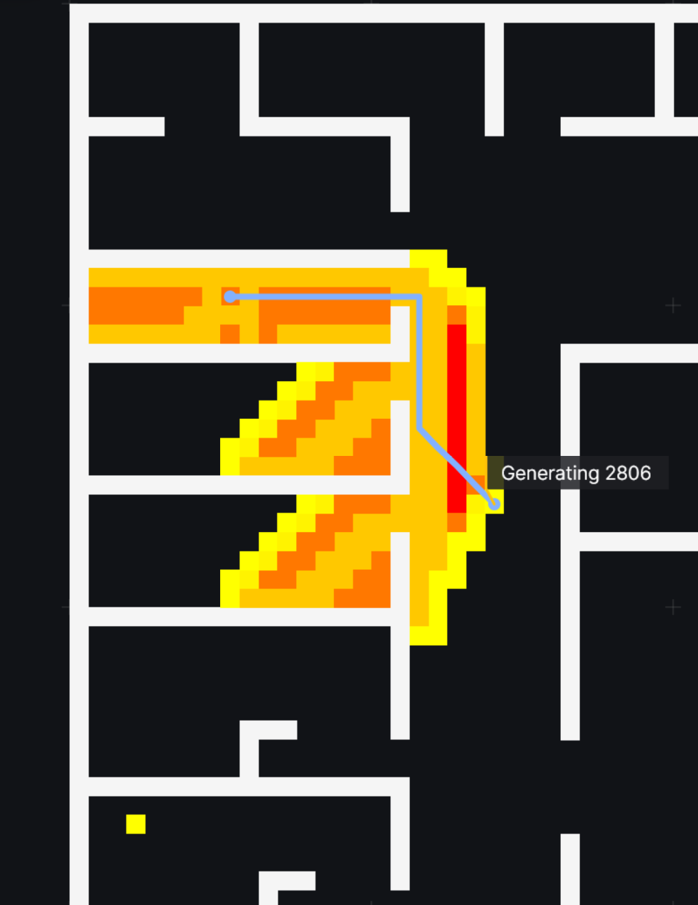

# Arc 1: Pathfinding Search

In this exercise, we are going to implement the basic Lego blocks of search:

##### ⏭️ Expander

This is the expander that generates valid successors of the current state.

##### 💡 Heuristic

This is a function that estimates the cost of reaching the goal from the current state.
<br/>

**Switch to the A1 branch to continue: `git checkout a1`**

---

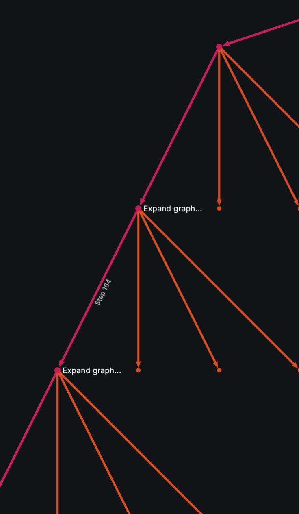

# The Expander

During search, an expander generates valid successors of the current state.
This means that expanders are _domain-dependent_, and must be modified to match the `rules' of the world.

In this exercise, your task is to implement an expander for the RobotRunners competition. Robots are able to perform the following actions:
1) Move forward one step,
2) Rotate 90 degrees either clockwise (CW) or counter-clockwise (CCW),
<!-- 3) Wait at their current location. -->

In `ex1_lorr_expander.py`, read through `expand()` and modify the helper functions `get_actions()` and `move()` to generate nodes based on the above actions each robot can perform.

_HINT: in get_actions(), you need to make sure that moves are valid within the environment._

---

# RobotRunners Expander - SOLUTION

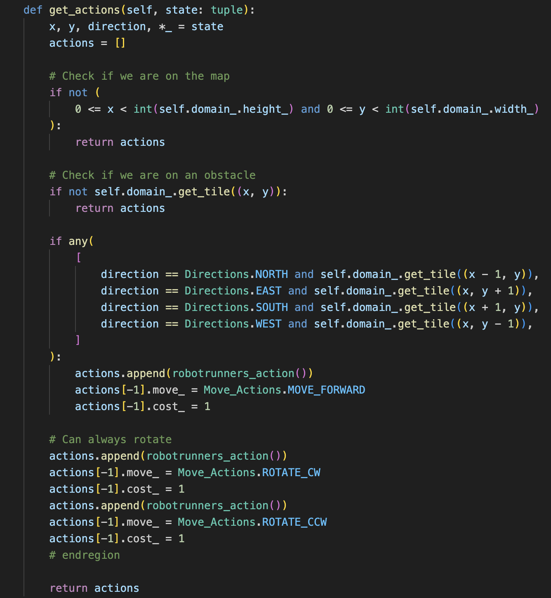 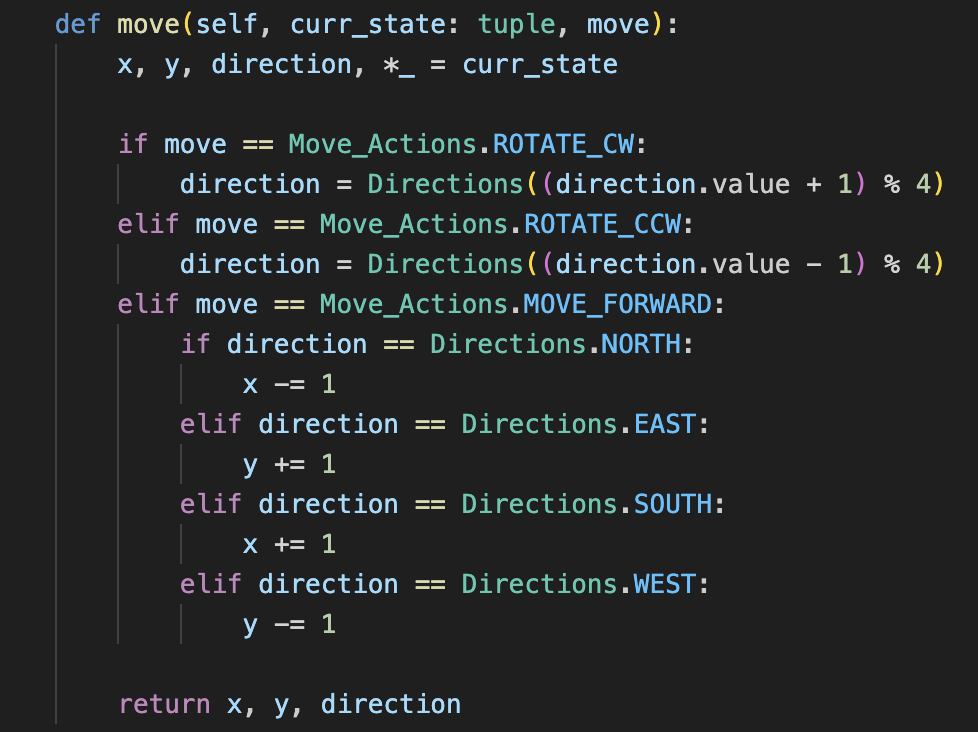

---

# Domain-Dependent Heuristics

We now have a way to generate new states, but we also have to evaluate which looks the most promising!

Nodes in A\* are ranked by $f(n) = g(n) + h(n)$.

Unlike what we have seen of heuristics in PDDL, in pathfinding we aim to implement domain-dependent hueristics. Let's have a quick look at implementing a couple.

Your task is to implement the:

1. `manhattan_distance_heuristic()`,
2. `octile_distance_heuristic()`, and
3. `straight_line_distance()`

Manhattan distance returns the optimisitic grid-distance between any two locations (ignoring obstacles).
The Octile distance returns a similar estimate, but it allows diagonal movements (cost = $\sqrt2$).
The Straight line distance is just the direct Euclidean distance between two points (length of a straight line).

---

# Heuristics - SOLUTION

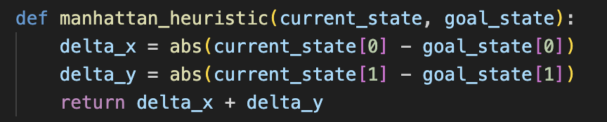

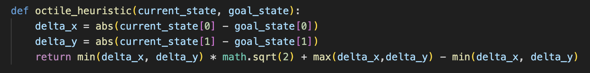

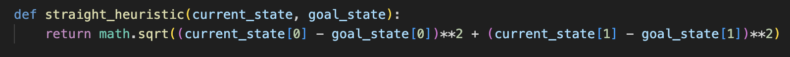

---

# Creating the search

Time to put your search together!

In `a1/ex3_create_search.py`, you'll find the scaffolding for a search engine. Modify it to use the manhattan distance heuristic and the expander you implemented in the previous exercise:

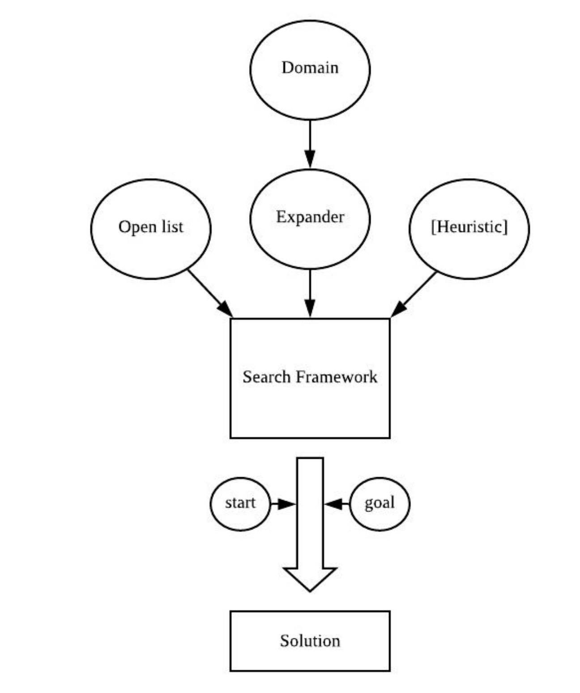 

<!-- 
```py
def create_search(domain: robotrunners):
    open_list = bin_heap(search_node.compare_node_f)
    expander = lorr_expander(domain)
    heuristic = straight_heuristic
    return graph_search(open_list, expander, heuristic_function=heuristic)
``` -->

---

# Run your Code

Run the start kit with one agent:

```bash
opss25-lifelong --inputFile example_problems/random/random_1.json -s 100
```

Then, visualise your solution:

```bash
opss25-planviz --plan=output.json --map=example_problems/random/maps/random-32-32-20.map
```

If on Apple Silicon, you may need to run `source activate base` from your bash shell.

---

# How to Choose a Heuristic?

Not all heuristics are equal. What do we _want_ from a heuristic?

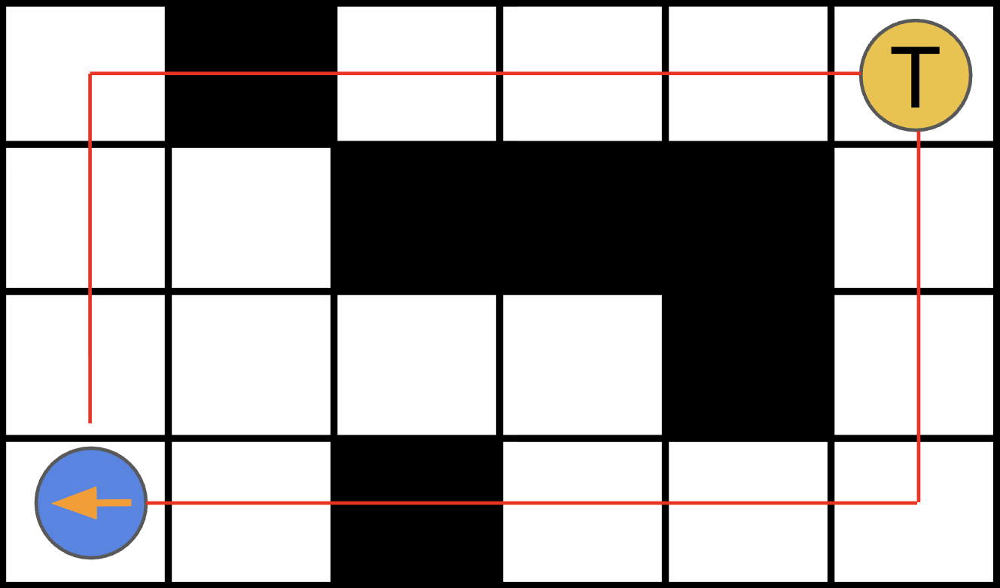

<!-- Need to create an example image
(I was also thinking of jmping to PostHoc instead with pre-generated search traces) -->

---

# Improving our Heuristic

Task: Modify the manhattan distance heuristic to be _direction-aware_.

We have provided a template for `get_init_turns` to help calculate the number of turns that may be required for an agent to face in one of the heuristic-recommended directions.

_Hint: agents may require some number of turns to face the correct direction, and then may need to bend their path._

---

# Improving our Heuristic - SOLUTION

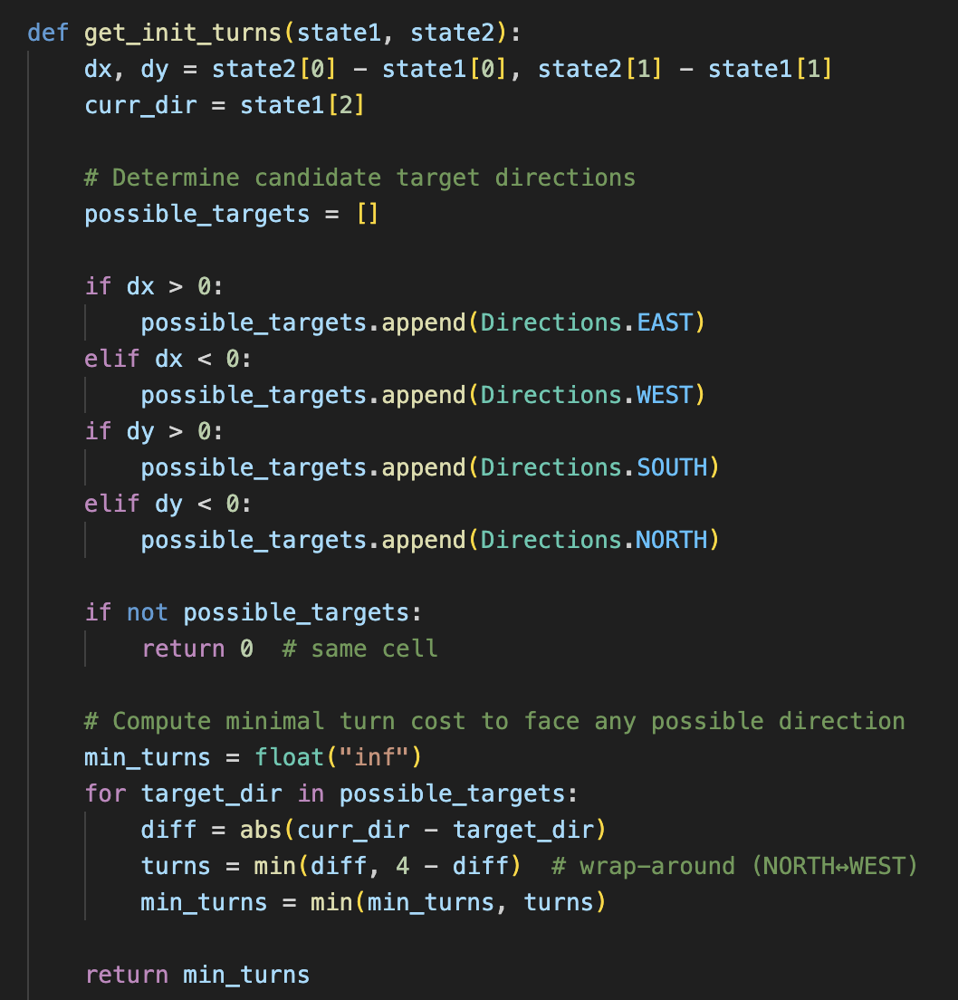 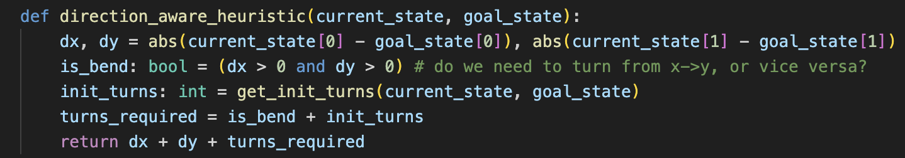

---

# Congrats on completing the first exercise!

You should now have a working A\* search.

### What's next?

- 💡 Check out the `ex4_basic_planner.py` file. It contains the structural code that runs your search engine in the context of the robot runner start kit.

- 💡 Experiment with various heuristics.

- 💡 Try creating a visualisation using Posthoc.

---

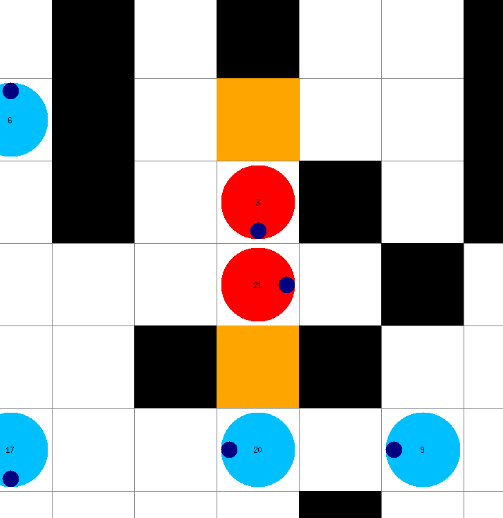

# Arc 2: Dealing with Agent Collisions

We now have a working low-level search! Agents can get where they need to go.

But agents are not alone. Agents must plan paths in a _shared_ environment.

Switch to the `a2` branch to continue. We have already filled out the expander from a1 for you.

Let's see what happens when we plan paths for _two_ agents.
Run and observe the output:

```bash
opss25-lifelong --inputFile example_problems/random/random_2.json -s 500
opss25-planviz --plan=output.json --map=example_problems/random/maps/random-32-32-20.map
```

---

# Dealing With Agent Collisions - Part A

Evidently, we have an issue now. Agents must learn to avoid each other!

In this Exercise, we will work on implementing a way of tracking locations that agents occupy in order to avoid collisions. We call this data strcture a _reservation table_, and it has two main methods:

1. `reserve(state)` (reserves a specific location for an agent),
2. `is_reserved(state)` (which checks if a location is reserved)

In your code, you will see template functions for these two functions. It is your task to complete the implementation. You are safe to assume that the class has an inbuilt `vertex_table`, which is a 2D array indexed by `[x][y]`.

---

# Dealing With Agent Collisions - Part B

You will also need to complete this implementation---agents need to reserve their location in our high-level planner! To do so, you will need to:

3. modify your `expander` so that it does not generate new states if there is a collision!
4. modify the `high-level planner` to make agents reserve their path. We can call the low level planner every single time step to make things easier.

Test your implementation (**what looks different?**):

```bash
opss25-lifelong --inputFile example_problems/random/random_2.json -s 100
opss25-planviz --plan=output.json --map=example_problems/random/maps/random-32-32-20.map
```

---

# Reservation table - SOLUTIONS

```py
def reserve(self, *states: list[robotrunners_state]):
    for state in states:
        x, y, *_ = state
        self.vertex_table[x][y] = True
```

```py
def is_reserved(self, state: robotrunners_state):
    x, y, *_ = state
    return self.vertex_table[x][y]
```

---

# Checking reservation table - SOLUTION

```py
def expand(self, current):
        self.succ_.clear()
        for a in self.get_actions(current.state_):
            new_state = self.move(current.state_, a.move_)

            if self.reservation_table_.is_reserved(new_state):
                continue

            self.succ_.append((new_state, a))
        return self.succ_[:]

```

---

# Reserve paths - SOLUTION

```py
def plan(
        env: MAPF.SharedEnvironment,
        paths: list[list],
        last_did_error: bool = False,
    ):
        table.clear()
        for i in range(len(paths)):
            paths[i] = run_search(env, i)
            # Check if we've got a solution
            if paths[i]:
                # Reserve all points on the path
                table.reserve(interop.get_agent_state(env, i), *paths[i])
        return paths
```

---

# Dealing With Agent Collisions - Part C

While our agents now reserve their paths, this is done naively.
You see a lot of agents fail to find a solution, and thus not move (no agents actually occupy these locations!).

In the simulator, agents plan paths at each timestep anyways.

- 💡 As such, we can avoid collisions by only checking _next-step_ reservations.

Task: modify the `expand()` function to check for collisions only for the first step in your path.

Test and visualise your implementation - do things seem to improve?

---

# Reserve paths, slightly better approach - SOLUTION

```py
def plan(
        env: MAPF.SharedEnvironment,
        paths: list[list],
        last_did_error: bool = False,
    ):
        table.clear()
        for i in range(len(paths)):
            paths[i] = run_search(env, i)
            # Check if we've got a solution
            if paths[i]:
                # Reserve only the first point on the path
                table.reserve(interop.get_agent_state(env, i), paths[i][0])
        return paths
```

---

# Congrats on completing the second exercise!

You can now plan collision-free paths for multiple agents in a shared environment.

### What's next?

- 💡 Experiment with visualising various scenarios.

- 💡 Think about how we can improve our existing systems

After the break, we will expand upon these ideas to bridge the gap to MAPF algorithms and lifelong planning.
