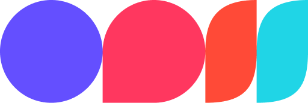

<style>
    @import "base";
    @import url("https://fonts.googleapis.com/css2?family=Geist&display=swap");
    :root {
        font-size: 22px;
        font-family: "Geist", sans-serif;
        --color-fg-default: white;
        --color-canvas-default: white;
        padding: 64px;
    }
    footer, header { 
        padding: 32px 32px;
    }
    h1 > strong {
        color: #f1f1f1;
    }
</style>



# **Introduction to Multi-agent Path Planning**

In this tutorial, you'll learn to develop a multi-agent path planning algorithm.

---

# Set up your environment

Smth smthSmth smthSmth smthSmth smthSmth smthSmth smth :satisfied:

---

# What is A\*?

Smth smthSmth smthSmth smthSmth smthSmth smthSmth smth

---

# Exercise 1

foobar

```py
if (self.domain_.get_tile((x, y + 1))):
        retval.append(grid_action())
        retval[-1].move_ = Move_Actions.MOVE_RIGHT
        retval[-1].cost_ = 1

if (self.domain_.get_tile((x - 1, y))):
    retval.append(grid_action())
    retval[-1].move_ = Move_Actions.MOVE_UP
    retval[-1].cost_ = 1
```
